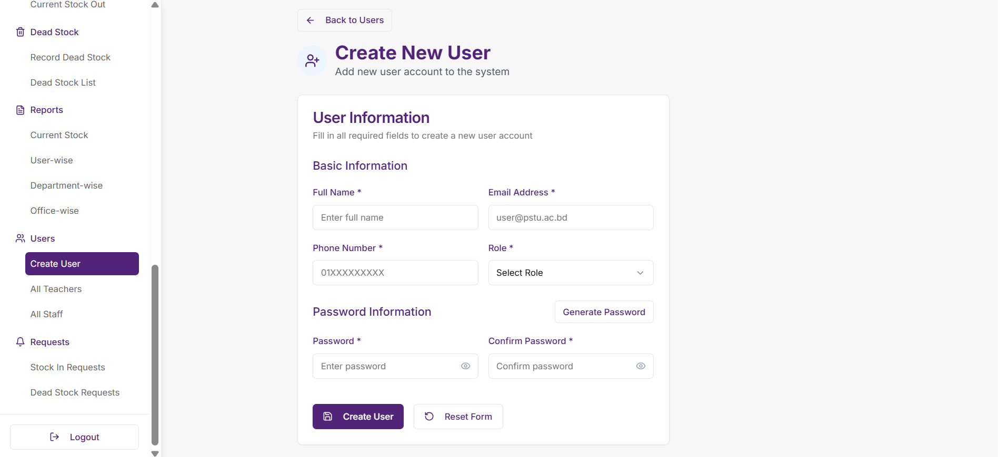
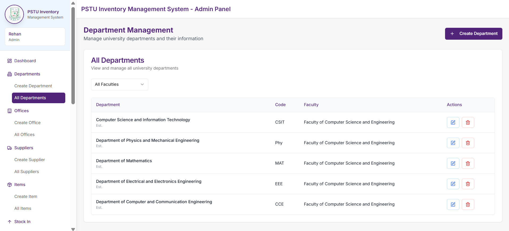
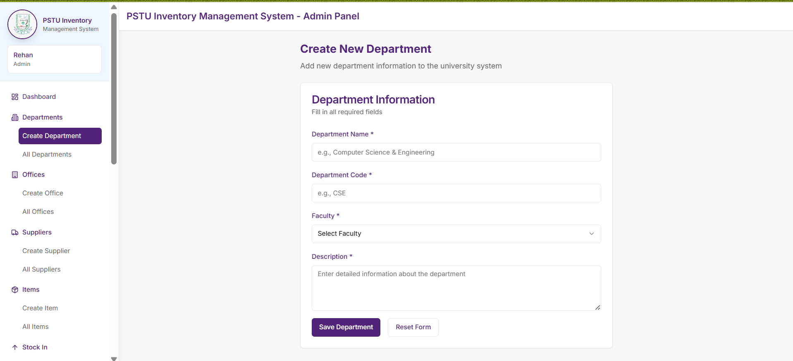
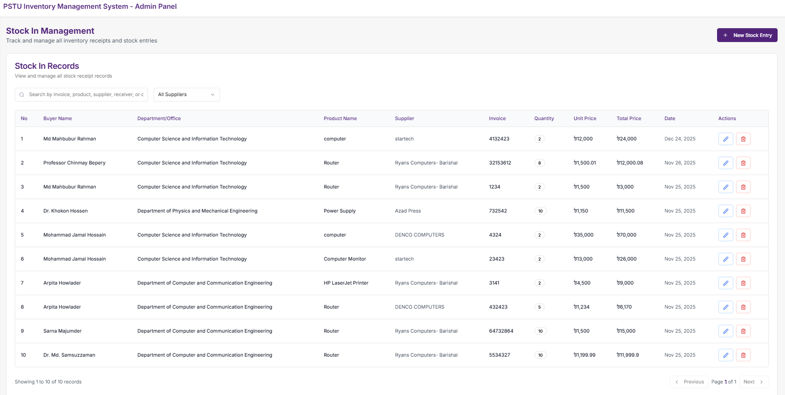
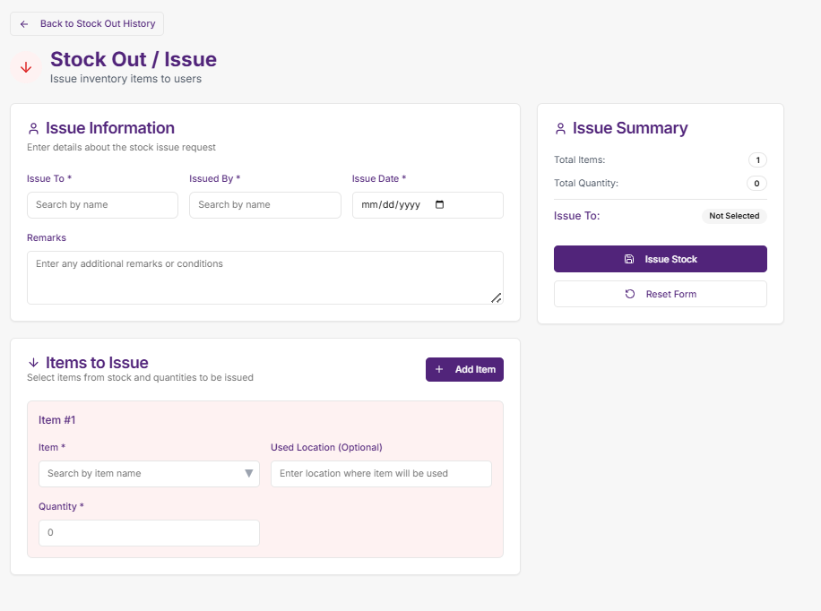
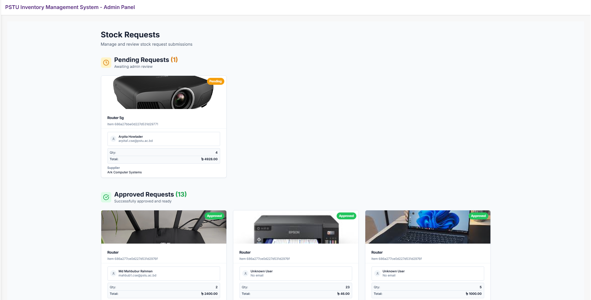
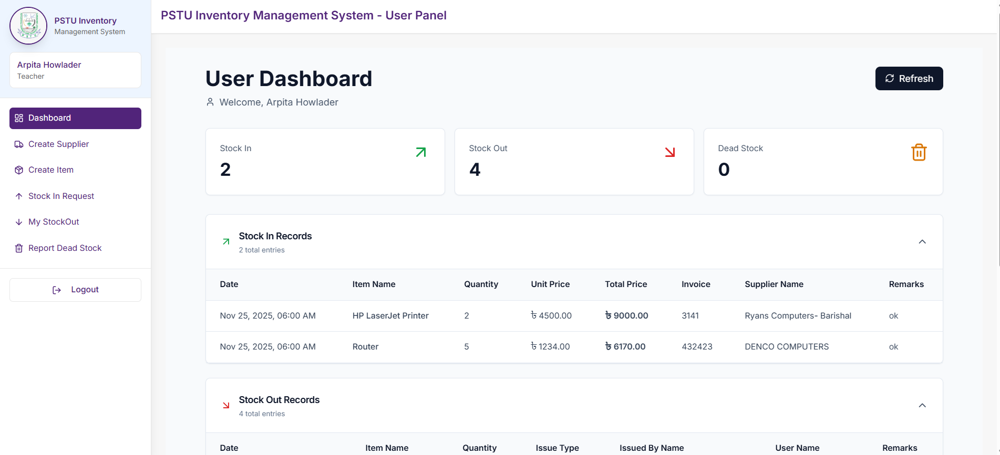
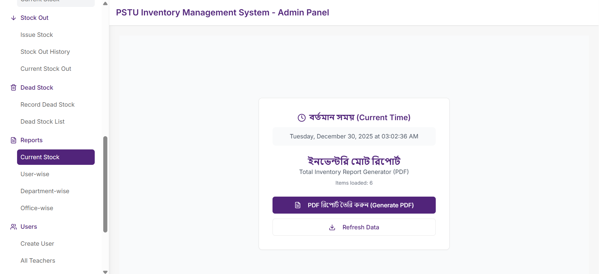
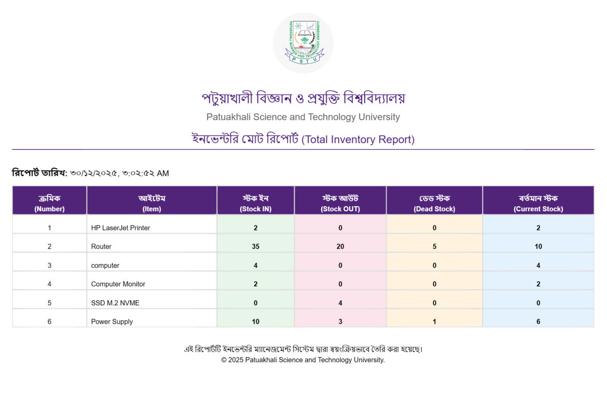

# PSTU Inventory Management System with Blockchain Technology


> A full‑stack Inventory Management System built for **Patuakhali Science & Technology University (PSTU)** that integrates a lightweight blockchain module to provide an immutable audit trail for critical inventory actions (stock-in, stock-out, approvals and dead-stock entries).

**Live deployment:** [https://stock.pstu.ac.bd](https://stock.pstu.ac.bd) — currently used by PSTU authority.

---

## Table of Contents

1. [Project Overview](#project-overview)
2. [Key Features & Pages](#key-features--pages)
3. [Architecture & Folder Structure](#architecture--folder-structure)
4. [Tech Stack](#tech-stack)
5. [Installation & Setup](#installation--setup)

   * [Prerequisites](#prerequisites)
   * [Environment Variables](#environment-variables)
   * [Run Backend](#run-backend)
   * [Run Frontend](#run-frontend)
6. [Backend — API Reference](#backend--api-reference-common-endpoints)
7. [Data Models (summary)](#data-models-summary)
8. [Blockchain Integration — how it works](#blockchain-integration--how-it-works)
9. [User Flows](#user-flows-short)
10. [Screenshots](#screenshots--where-to-add-yours)
11. [Testing & Troubleshooting](#testing--troubleshooting)
12. [Roadmap & TODOs](#roadmap--todos)
13. [Contributing](#contributing)
14. [License & Contact](#license--contact)

---

## Project Overview

This project is an Inventory Management System tailored for institutions that need traceable, auditable changes to inventory data. It provides:

* Centralized CRUD for items, suppliers, departments, offices and users.
* Request and approval workflow for stock movements (stock-in / stock-out).
* Dead-stock tracking and reporting.
* Exportable reports and dashboards for administrators.
* A SHA‑256 hash–based blockchain-style audit mechanism that stores chained hashes of important transactions for tamper‑evidence.

**Used in production:** The application is deployed at `https://stock.pstu.ac.bd` and is currently in use by PSTU authority. Update environment configs and access controls before deploying elsewhere.

---

## Key Features & Pages

Below are the important pages with screenshots.

### 1. Admin Dashboard

Summary of total items, suppliers, requests and stock levels.


### 2. Login

Authentication with role‑aware redirect.


### 3. Create User

Create, edit, assign roles and deactivate users.



### 4. Department List

View and manage departments.



### 5. Create Department

Create new departments with validation.



### 6. Suppliers

Manage suppliers and link them with items.


### 7. Stock In

Receive items and increase inventory.




### 8. Stock Out

Issue items and reduce inventory.



### 9. Stock In Requests

Pending, approved and rejected stock-in requests.



### 10. Dead Requests

Dead stock and rejected request reports.


### 11. User Dashboard

User DashBoard



### 12. User Stock In Request

User Stock In Request with image verification


### 13. Reports

Generate and export inventory reports.




### 14. Blockchain / Block Page

View block history and verify integrity.


---

## Architecture & Folder Structure

```
backend/
  ├─ config/
  ├─ middleware/
  ├─ routes/
  ├─ models.js
  ├─ block_page.js
  └─ server.js

frontend/
  ├─ app/
  ├─ components/
  ├─ hooks/
  ├─ lib/
  └─ public/screenshots/

README.md
package.json
```

Notes:

* `block_page.js` contains SHA‑256 hash chaining and verification logic.
* `frontend/public/screenshots/` is where images used by the README should live.

---

## Tech Stack

* Frontend: Next.js (App Router), TypeScript, Tailwind CSS
* Backend: Node.js, Express
* Database: MongoDB (Mongoose)
* Blockchain: SHA‑256 hash–chained audit trail
* Auth: JWT-based (role middleware)

---

## Installation & Setup

### Prerequisites

* Node.js v18+
* npm or yarn
* MongoDB (Atlas or local)

### Environment Variables

Create `.env` in `backend/`:

````env
JWT_SECRET=your_jwt_secret
EMAIL_USER=your_email@gmail.com
EMAIL_PASS=your_email_password
MONGO_URI=mongodb+srv://<user>:<pass>@cluster
PORT=5000
BLOCKCHAIN_SIGNING_KEY=your_signing_key
REACT_APP_API_URL=http://localhost:5000/api

````

For frontend (`frontend/.env.local`):

````env
NEXT_PUBLIC_API_URL=http://localhost:5000
````

### Run Backend

```bash
cd backend
npm install
npm run dev    # or `node server.js`
```

### Run Frontend

```bash
cd frontend
npm install
npm run dev
# open http://localhost:3000
```

---

## Backend — API Reference (common endpoints)

> Adapt these to match your actual route names.

* `POST /api/auth/login` — Login; returns JWT
* `GET /api/users/get` — List users (admin)
* `POST /api/users/create` — Create user (admin)
* `GET /api/items/get` — List items (supports `?q`, `?page`)
* `POST /api/items/create` — Create item (admin)
* `PUT /api/items/:id` — Update item
* `GET /api/stockins/get` — List stock-in records
* `POST /api/stockins/create` — Create stock-in (updates inventory + adds block)
* `POST /api/stockouts/create` — Create stock-out (reduces inventory + adds block)
* `GET /api/requests` — Get requests by status
* `POST /api/requests/:id/approve` — Approve request
* `POST /api/deadstocks/create` — Record dead/obsolete item
* `GET /api/blockchain/blocks` — Get block list
* `POST /api/blockchain/verify` — Verify blockchain integrity
.

---

## Data Models (summary)

* **User**: `{ _id, name, email, passwordHash, role: ['admin','user'], departmentId, isActive }`
* **Item**: `{ _id, name, sku, category, quantity, minQuantity, supplierId, location, unit }`
* **Supplier**: `{ _id, name, contact, email, address }`
* **Request**: `{ _id, itemId, requestedBy, quantity, purpose, status, approvedBy, approvedAt }`
* **StockRecord**: `{ _id, itemId, type:['in','out'], qty, createdBy, remarks, referenceId }`
* **DeadStock**: `{ _id, itemId, quantity, reason, recordedBy, approved }`
* **Block**: `{ index, timestamp, dataHash, previousHash, hash, data }`

---

## Blockchain Integration — how it works

This system uses a **SHA‑256 hash–based blockchain-style audit mechanism**, not a traditional file-based distributed blockchain.

### How it works

1. When a critical action occurs (stock-in, stock-out, request approval, dead-stock entry), the backend creates a structured transaction payload.
2. The payload is hashed using the **SHA‑256 algorithm**.
3. Each record stores:

   * `currentHash` (SHA‑256 of current data)
   * `previousHash` (hash of the previous transaction)
4. These hashes are chained logically, creating an **immutable sequence of records**.
5. Any modification to historical data breaks the hash chain and is immediately detectable during verification.

### What this is (and is not)

* Tamper‑evident audit trail
* Lightweight and fast (no mining, no consensus overhead)
* Suitable for institutional inventory systems
* Not a decentralized cryptocurrency blockchain
* No proof‑of‑work or peer‑to‑peer consensus

### Verification

* The blockchain page recalculates SHA‑256 hashes and compares them with stored values.
* If any hash mismatch is found, the system flags the record as **tampered**.

**Why this approach was chosen:**
It provides blockchain‑like integrity guarantees while remaining simple, performant, and practical for real‑world university inventory management.

---

## User Flows (short)

**Stock-out (user → admin)**

1. User creates a stock-out request.
2. Admin approves; quantity is reduced; stock-out record created; a block is appended.

**Dead-stock**

1. Item flagged as dead with details.
2. Admin approves; record created and a block appended.

---


## Testing & Troubleshooting

* MongoDB connection fails: check `MONGO_URI` and network.
* JWT errors: confirm `JWT_SECRET` is consistent.
* Port conflicts: set `PORT` in `.env` or update dev scripts.
* Blockchain verify: `GET /api/blockchain/blocks` then `POST /api/blockchain/verify`.

---

## Roadmap & TODOs

* Add finer-grained role-based UI permissions
* Add unit/integration tests (Jest / Supertest)
* Harden blockchain: digital signatures, remote storage, or peer replication
* Improve mobile responsiveness and accessibility

---

## Contributing

1. Fork the repo
2. Create a feature branch: `git checkout -b feat/my-feature`
3. Install deps and run locally
4. Open a PR with description and screenshots

Please follow code style and add tests where possible.

---


## Maintainer: Rakibul Islam Rehan
