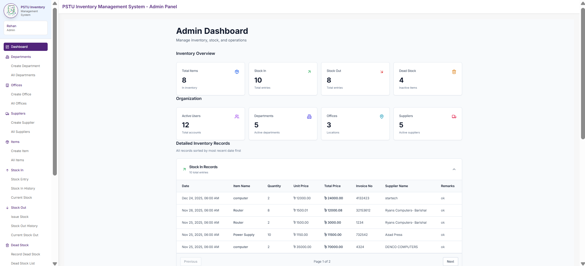
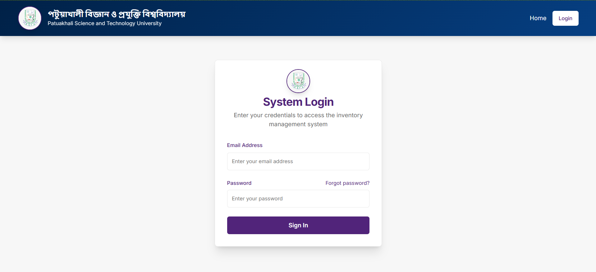

# PSTU Inventory Management System with Blockchain Technology


> A full‑stack Inventory Management System built for **Patuakhali Science & Technology University (PSTU)** that integrates a lightweight blockchain module to provide an immutable audit trail for critical inventory actions (stock-in, stock-out, approvals and dead-stock entries).

**Live deployment:** [https://stock.pstu.ac.bd](https://stock.pstu.ac.bd) — currently used by PSTU authority.

---

## Table of Contents

1. Project Overview
2. Key Features & Pages
3. Architecture & Folder Structure
4. Tech Stack
5. Installation & Setup

   * Prerequisites
   * Environment Variables
   * Run Locally (Backend & Frontend)
6. Backend — API Reference (common endpoints)
7. Data Models (summary)
8. Blockchain Integration — how it works
9. User Flows & Interaction Details
10. Screenshots & Where to add yours
11. Testing & Troubleshooting
12. Roadmap & TODOs
13. Contributing
14. License & Contact

---

## Project Overview

This project is an Inventory Management System tailored for institutions that need traceable, auditable changes to inventory data. It provides:

* Centralized CRUD for items, suppliers, departments, offices and users.
* Request and approval workflow for stock movements (stock-in / stock-out).
* Dead-stock tracking and reporting.
* Exportable reports and dashboards for administrators.
* A file-backed blockchain module that stores hashed records of important transactions for tamper-evidence.

**Used in production:** The application is deployed at `https://stock.pstu.ac.bd` and is currently in use by PSTU authority. Update environment configs and access controls before deploying elsewhere.

---

## Key Features & Pages

Below are the important pages with screenshots. Images are loaded from `frontend/public/screenshots/`.

### 1. Admin Dashboard

Summary of total items, suppliers, requests and stock levels.



### 2. Login

Authentication with role-aware redirect.



### 3. Users Management

Create, edit, assign roles and deactivate users.


### 4. Items List

View and manage all inventory items.


### 5. Create Item

Detailed item creation with validation.


### 6. Suppliers

Manage suppliers and link them with items.


### 7. Stock In

Receive items and increase inventory.


### 8. Stock Out

Issue items and reduce inventory.


### 9. Requests

Pending, approved and rejected requests.


### 10. Dead Requests

Cancelled or failed requests.


### 11. Dead Stock

Mark obsolete or damaged items.


### 12. Departments

Manage departments.


### 13. Offices

Manage office locations.


### 14. Reports

Generate and export inventory reports.


### 15. Blockchain / Block Page

View block history and verify integrity.


---

## Architecture & Folder Structure

```
backend/
  ├─ config/
  ├─ middleware/
  ├─ routes/
  ├─ models.js
  ├─ block_page.js
  └─ server.js

frontend/
  ├─ app/
  ├─ components/
  ├─ hooks/
  ├─ lib/
  └─ public/screenshots/

README.md
package.json
```

Notes:

* `backend/block_chain` contains the file-backed chain logic used by `block_page.js`.
* `frontend/public/screenshots/` is where images used by the README should live.

---

## Tech Stack

* Frontend: Next.js (App Router), TypeScript, Tailwind CSS
* Backend: Node.js, Express
* Database: MongoDB (Mongoose)
* Blockchain: File-based simple hash-chained blocks
* Auth: JWT-based (role middleware)

---

## Installation & Setup

### Prerequisites

* Node.js v18+
* npm or yarn
* MongoDB (Atlas or local)

### Environment Variables

Create `.env` in `backend/`:

```env
PORT=5000
MONGO_URI=mongodb://localhost:27017/pstu_inventory
JWT_SECRET=your_jwt_secret_here
BLOCKCHAIN_PATH=./block_chain/data.json
```

For frontend (`frontend/.env.local`):

```env
NEXT_PUBLIC_API_URL=http://localhost:5000/api
NEXTAUTH_SECRET=your_frontend_secret_if_used
```

### Run Backend

```bash
cd backend
npm install
npm run dev    # or `node server.js`
```

### Run Frontend

```bash
cd frontend
npm install
npm run dev
# open http://localhost:3000
```

---

## Backend — API Reference (common endpoints)

> Adapt these to match your actual route names.

* `POST /api/auth/login` — Login; returns JWT
* `GET /api/users` — List users (admin)
* `POST /api/users` — Create user (admin)
* `GET /api/items` — List items (supports `?q`, `?page`)
* `POST /api/items` — Create item (admin)
* `PUT /api/items/:id` — Update item
* `GET /api/stock-in` — List stock-in records
* `POST /api/stock-in` — Create stock-in (updates inventory + adds block)
* `POST /api/stock-out` — Create stock-out (reduces inventory + adds block)
* `GET /api/requests` — Get requests by status
* `POST /api/requests/:id/approve` — Approve request
* `POST /api/dead-stock` — Record dead/obsolete item
* `GET /api/blockchain/blocks` — Get block list
* `POST /api/blockchain/verify` — Verify blockchain integrity

**Example: Create stock-in (curl)**

```bash
curl -X POST $API_URL/stock-in \
  -H "Authorization: Bearer <token>" \
  -H "Content-Type: application/json" \
  -d '{"itemId":"63f...","quantity":10,"supplierId":"...","receivedBy":"userId","remarks":"Received from supplier"}'
```

Response: `201 Created` with updated item stock and a blockchain entry object.

---

## Data Models (summary)

* **User**: `{ _id, name, email, passwordHash, role: ['admin','user'], departmentId, isActive }`
* **Item**: `{ _id, name, sku, category, quantity, minQuantity, supplierId, location, unit }`
* **Supplier**: `{ _id, name, contact, email, address }`
* **Request**: `{ _id, itemId, requestedBy, quantity, purpose, status, approvedBy, approvedAt }`
* **StockRecord**: `{ _id, itemId, type:['in','out'], qty, createdBy, remarks, referenceId }`
* **DeadStock**: `{ _id, itemId, quantity, reason, recordedBy, approved }`
* **Block**: `{ index, timestamp, dataHash, previousHash, hash, data }`

---

## Blockchain Integration — how it works

1. On critical actions (stock-in, stock-out, approvals, dead-stock) the backend builds a payload describing the event.
2. The payload is hashed and stored inside a new block appended to the chain file. Each block contains `index`, `timestamp`, `dataHash`, `previousHash`, and `hash` (block header).
3. `block_page.js` exposes helpers for creating blocks and verifying chain integrity.
4. Use `GET /api/blockchain/blocks` to view the chain and `POST /api/blockchain/verify` to run verification.

**Note:** This is a simple, local file-backed chain intended for tamper-evidence and audit trails. For production-grade distributed immutability, consider adding signatures, replication, append-only remote storage, or a consensus layer.

---

## User Flows (short)

**Stock-out (user → admin)**

1. User creates a stock-out request.
2. Admin approves; quantity is reduced; stock-out record created; a block is appended.

**Dead-stock**

1. Item flagged as dead with details.
2. Admin approves; record created and a block appended.

---

## Screenshots & Where to add yours

Put real screenshots at `frontend/public/screenshots/` using these filenames:

```
dashboard.png
login.png
users.png
items.png
create-item.png
suppliers.png
stock-in.png
stock-out.png
requests.png
dead-requests.png
dead-stock.png
departments.png
offices.png
reports.png
block_page.png
banner.png
```

After adding, `git add` and `git commit` — GitHub will render them in this README.

---

## Testing & Troubleshooting

* MongoDB connection fails: check `MONGO_URI` and network.
* JWT errors: confirm `JWT_SECRET` is consistent.
* Port conflicts: set `PORT` in `.env` or update dev scripts.
* Blockchain verify: `GET /api/blockchain/blocks` then `POST /api/blockchain/verify`.

---

## Roadmap & TODOs

* Add finer-grained role-based UI permissions
* Add unit/integration tests (Jest / Supertest)
* Harden blockchain: digital signatures, remote storage, or peer replication
* Improve mobile responsiveness and accessibility

---

## Contributing

1. Fork the repo
2. Create a feature branch: `git checkout -b feat/my-feature`
3. Install deps and run locally
4. Open a PR with description and screenshots

Please follow code style and add tests where possible.

---

## License & Contact

MIT License — change if required.

Maintainer: **Your Name / PSTU Team**

If you want, I can also generate a short `CONTRIBUTING.md` or `CHANGELOG.md`, or replace the README image placeholders with screenshots you provide. — tell me which pages/screenshots to add.
